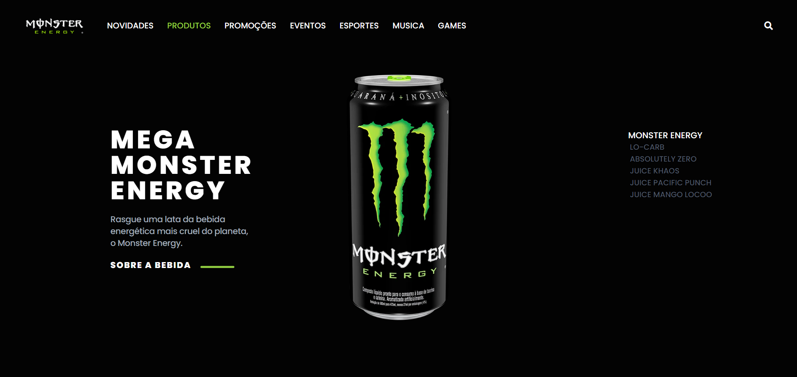

# Redesign Monster Energy

 

> Apaixonado pelos Energéticos da Monster decidi redesenhar a landing page deles, com um visual mais recente e moderno.

### Ajustes e melhorias

O projeto ainda está em desenvolvimento e as próximas atualizações serão voltadas nas seguintes tarefas:

- [ ] Novas Seções

### [Ver Preview](https://guilhermesdb.github.io/Monster-Energy-Redesign-Tailwindcss/)

## 👨🏻‍💻 Techs 

 

## 🤝 Colaboradores

Agradecemos às seguintes pessoas que contribuíram para este projeto:

<table>
  <tr>
    <td align="center">
      <a href="#">
         
        
          <b>Guilherme S Barros</b>
        
      </a>
    </td>
  </tr>
</table>

## 📝 Licença

Esse projeto está sob licença. Veja o arquivo [LICENÇA](LICENSE.md) para mais detalhes.

[⬆ Voltar ao topo](#redesign-monster-energy) 
